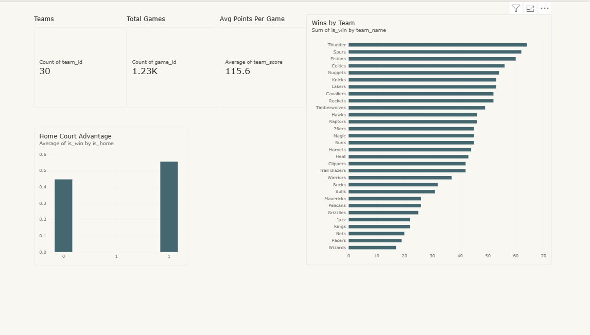

# NBA Analytics Pipeline

A small end-to-end data engineering pipeline built to practice the core DE toolkit — Python, SQL, dbt and Power BI — using real NBA data.

## Overview

This project ingests NBA game and team data from a public Kaggle dataset, loads it into a local PostgreSQL warehouse, transforms it into an analytics-ready Kimball star schema with dbt, and visualizes it in a Power BI dashboard.

```
Kaggle CSV --> (pandas/SQLAlchemy) --> Postgres schema "raw"   (bronze)
                                              |
                                            dbt (staging views -> marts tables)
                                              |
                                     Postgres schema "marts"  (gold, star schema)
                                              |
                                        Power BI dashboard
```

## Tech Stack

| Layer | Tool |
|---|---|
| Ingestion | Python, pandas |
| Loading | SQLAlchemy, psycopg2 |
| Warehouse | PostgreSQL 16 (Docker) |
| Dependency management | uv |
| Transformation | dbt-postgres (staging + marts, tests, docs) |
| Visualization | Power BI |

## Data Source

[`eoinamoore/historical-nba-data-and-player-box-scores`](https://www.kaggle.com/datasets/eoinamoore/historical-nba-data-and-player-box-scores) — historical NBA box scores from 1947 to present, updated nightly.

For this project, data is scoped down to the **2025–2026 regular season** to keep the pipeline lightweight while covering the full toolset.

## Getting Started

**Prerequisites:** Docker Desktop, a free [Kaggle](https://www.kaggle.com/) account (for the dataset), Python with [uv](https://github.com/astral-sh/uv), Power BI Desktop (optional, for the dashboard).

```bash
# 1. Clone the repo
git clone https://github.com/duongla1999/nba-analytics-pipeline.git
cd nba-analytics-pipeline

# 2. Copy .env.example to .env and fill in your own Postgres credentials
cp .env.example .env

# 3. Start Postgres
docker compose up -d

# 4. Create the raw schema
docker exec -it nba_postgres psql -U <user> -d <db> -c "CREATE SCHEMA IF NOT EXISTS raw;"

# 5. Install Python dependencies
uv sync

# 6. Download the dataset from Kaggle into ./data, then run the ingestion pipeline
uv run main.py

# 7. Run the dbt transformations (staging views + marts star schema)
cd nba_analytics
uv run dbt run

# 8. Run the dbt tests (unique, not_null, relationships)
uv run dbt test

# 9. (optional) Browse the model lineage graph
uv run dbt docs generate
uv run dbt docs serve
```

Then connect Power BI Desktop (Import mode) to the Postgres warehouse and point it at the marts schema to explore the dashboard.

## Data Scope

- Filtered to `gameType = 'Regular Season'`, games between `2025-10-01` and `2026-06-30`.
- Loaded into schema `raw`: `games` (~1,230 rows), `players` (~6,700), `teamStatistics` (~2,460), `teamHistories` (~140).
- Intentionally excluded for this MVP: `PlayerStatistics` (~400MB), `PlayerStatisticsExtended` (~450MB), `PlayByPlay` (~900MB) and `LeagueSchedule` — large, detailed tables not needed for the current scope; may be added later.

## dbt Models

Two-layer model under `nba_analytics/models/`, following a Medallion approach (raw → staging → marts) with a Kimball star schema at the marts layer.

**Staging (views)** — one-to-one with each raw source table, renaming `camelCase` → `snake_case`:

- `stg_games`, `stg_players`, `stg_team_histories`, `stg_team_statistics`

**Marts (tables)** — star schema for the dashboard:

- `dim_teams` — one row per team. Built from `stg_team_histories`, which has one row *per name/city era* a franchise has had (e.g. Baltimore Bullets → Washington Wizards), so it's deduplicated with `ROW_NUMBER() OVER (PARTITION BY team_id ORDER BY season_active_till DESC)`, keeping only the latest era per `team_id` (`season_active_till = 2100` is the sentinel for "currently active").
- `dim_players` — one row per player, passthrough of `stg_players`.
- `fct_team_game_stats` — one row per team per game, built directly from `stg_team_statistics` (no join to `stg_games` needed — it adds no extra columns).

dbt tests (`_marts__schema.yml`): `unique` + `not_null` on `dim_teams.team_id` and `dim_players.player_id`, `not_null` on `fct_team_game_stats.game_id`/`team_id`, and a `relationships` test tying `fct_team_game_stats.team_id` back to `dim_teams`.

## Power BI Dashboard

The star schema is loaded into Power BI Desktop (Import mode) to build a small dashboard on top of it. `fct_team_game_stats.team_id` links to `dim_teams` as the active relationship, while `opponent_team_id` links to a Power Query duplicate of `dim_teams` used as a *role-playing dimension*, since Power BI only allows one active relationship between two tables. `dim_players` isn't connected yet — there's no player-level fact table so far.



- **Teams / Total Games / Avg Points Per Game** — KPI cards. "Teams" is a distinct count of `team_id` from `fct_team_game_stats`, not from `dim_teams`: `dim_teams` (built on `raw.teamHistories`) contains the full NBA history back to 1946, including long-dissolved franchises, so counting from there gives 97 instead of the 30 teams actually active this season.
- **Wins by Team** — sum of `is_win` by `team_name`, sorted descending.
- **Home Court Advantage** — average of `is_win` by `is_home`, landing at ~0.55 home / ~0.45 away, in line with real NBA home-court advantage.

## Possible Next Steps

- A third chart, "Offense vs Defense" (avg `team_score` vs `opponent_score` per team) — designed but not built.
- `relationships` test for `opponent_team_id`, and a composite-uniqueness test on `fct_team_game_stats` (needs the `dbt_utils` package).
- Swap the CSV source for live `nba_api` data and migrate the warehouse to BigQuery/Snowflake.
- Lightweight orchestration (cron/Airflow).
